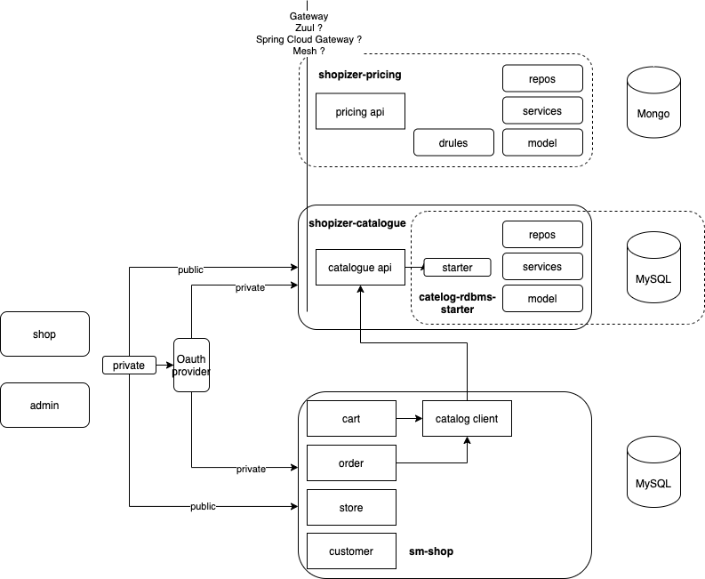

## Shopizer microservices

You can use the [editor on GitHub](https://github.com/shopizer-ecommerce/shopizer-catalogue-service/edit/main/docs/index.md) to maintain and preview the content for your website in Markdown files.

Whenever you commit to this repository, GitHub Pages will run [Jekyll](https://jekyllrb.com/) to rebuild the pages in your site, from the content in your Markdown files.

### ecosystem

IBD

### catalogue microservice

Catalogue microservice is the first candidate for microservice conversion

catalogue-service/shopizer-catalogue-service/shopizer-catalogue-rdbms-starter

Contains the code for catalogue model, pertaining services and repository